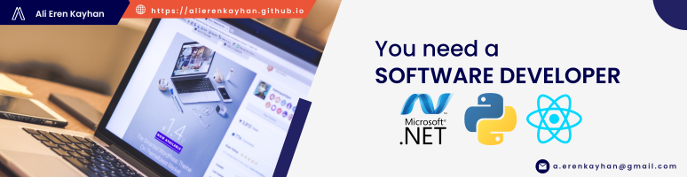

<!-------------------------------------------------visitor count------------------------------------------------------------------------------------------>

  
  
 
  

<!-------------------------------------------------first part-------------------------------------------------------------------------------------->

<h1 align = "center" >Hi,  I'm Ali Eren Kayhan </h1>
<h3 align = "center" > Student, Game Developer, Desktop and Mobile Application Developer </h3>
<h4 align = "center" >
 <!-- download cv button -->

 </h4>
 

        &nbsp;
       
 

 

<!---------------------------------------------------------About Me------------------------------------------------------------------------------------------>  

 <h2 align="center">:man_technologist: About Me :man_technologist:</h2>
 
 :man_technologist: About Me
 
 

 
-    I live in Istanbul, Turkey.
-    I am co-founder of MyEdu.
- 🗣️ I can speak English, Turkish, and German.
- 📚 I'm studying Computer Education and Educational Technology (CET) at Boğaziçi University.
- 🔭 I’m not currently working.   
- 🌱 I’m currently learning Game Industry.
- 💬 Ask me about anything.
- 📫 How to reach me: ali_erenbatman@hotmail.com

  

<!---------------------------------------------------------My Accounts----------------------------------------------------------------------------------------->  

<h2 align="center">📫 My Accounts 📫</h2>

📫 My Accounts 
 

<table border= "0">
  <tr>
    <td>&nbsp;&nbsp;&nbsp;&nbsp;<a href="https://www.linkedin.com/in/ali-eren-kayhan/">Ali Eren Kayhan</a></td>
    <td>&nbsp;&nbsp;&nbsp;&nbsp;<a href="https://www.instagram.com/kayhanalieren/">kayhanalieren</a></td>
    <td>&nbsp;&nbsp;&nbsp;&nbsp;<a href="https://www.facebook.com/alieren.kayhan.5/">Ali Eren Kayhan</a></td>
  </tr>
  <tr>
    <td>&nbsp;&nbsp;&nbsp;&nbsp;<a href="https://alierenkayhan.itch.io/">Alierenkayhan</a></td>
    <td>&nbsp;&nbsp;&nbsp;&nbsp;ali_erenbatman@hotmail.com</td>
     <td>&nbsp;&nbsp;&nbsp;&nbsp;<a href="https://alierenkayhanbouncet.blogspot.com/">alierenkayhanbouncet</a></td>
  </tr>
  <tr>
    <td>&nbsp;&nbsp;&nbsp;&nbsp;<a href="https://alierenkayhan.github.io/">alierenkayhan.github.io</a></td>
    <td>&nbsp;&nbsp;&nbsp;&nbsp;<a href="https://www.ted.com/profiles/34139055">Ali Eren Kayhan</a></td>
    <td>&nbsp;&nbsp;&nbsp;&nbsp;<a href="https://learn.unity.com/u/alierenkayhan?tab=profile">Ali Eren Kayhan</a></td>
  </tr>
    <tr>
    <td>&nbsp;&nbsp;&nbsp;&nbsp;<a href="https://www.youtube.com/channel/UCI8HFmI21vBN65Kc3x6L_4A">Ali Eren Kayhan</a></td>
  </tr>
</table>
 

<!---------------------------------------------------------Languages and Tools:----------------------------------------------------------------------------------------->  

  <h2 align="center">🧰 Languages and Tools 🧰</h2>
 
 🧰 Languages and Tools
 
    

  &nbsp;&nbsp; 
  &nbsp;&nbsp;  
  &nbsp;&nbsp;  
  &nbsp;&nbsp;  
  &nbsp;&nbsp; 
  &nbsp;&nbsp;  
  &nbsp;&nbsp;  
  &nbsp;&nbsp;  
  &nbsp;&nbsp;  
  &nbsp;&nbsp;  
  &nbsp;&nbsp;  
  &nbsp;&nbsp;  
  &nbsp;&nbsp;  

   
  

  Database: &nbsp; &nbsp; &nbsp; &nbsp; &nbsp; &nbsp; &nbsp; &nbsp; &nbsp; &nbsp; &nbsp;
  
      
  Design: &nbsp; &nbsp; &nbsp; &nbsp; &nbsp; &nbsp; &nbsp; &nbsp; &nbsp; &nbsp; &nbsp; &nbsp; &nbsp;
  
  
  
  

  Frameworks & Library: &nbsp; 
  
  
  
  
  Game Engine: &nbsp; &nbsp; &nbsp; &nbsp; &nbsp; &nbsp; &nbsp; &nbsp; 
  
   
  IDE: &nbsp; &nbsp; &nbsp; &nbsp; &nbsp; &nbsp; &nbsp; &nbsp; &nbsp; &nbsp; &nbsp; &nbsp; &nbsp; &nbsp; &nbsp; &nbsp; 
  
  
  
   
  Languages: &nbsp; &nbsp; &nbsp; &nbsp; &nbsp; &nbsp; &nbsp; &nbsp; &nbsp; &nbsp; 
  
  
  
  
  
   
  📱 Mobile Frameworks: &nbsp;
  
    
  Office: &nbsp; &nbsp; &nbsp; &nbsp; &nbsp; &nbsp; &nbsp; &nbsp; &nbsp; &nbsp; &nbsp;  &nbsp; &nbsp; &nbsp; 
  
  
  
   &nbsp; &nbsp; &nbsp; &nbsp; &nbsp; &nbsp; &nbsp; &nbsp; &nbsp; &nbsp; &nbsp;  &nbsp; &nbsp; &nbsp; &nbsp; &nbsp;  &nbsp; &nbsp; &nbsp;&nbsp;
  
  
  
  
  💻 OS: &nbsp; &nbsp; &nbsp; &nbsp; &nbsp; &nbsp; &nbsp; &nbsp; &nbsp; &nbsp; &nbsp; &nbsp; &nbsp;
  

 

 

<!---------------------------------------------------------Github Information----------------------------------------------------------------------------------------->  

 <h2 align="center">:information_source: Github Information :information_source:</h2>

 :information_source:	Github Information
  
 

  
  

    
 
 
     
         
  

  

<!---------------------------------------------------------Github Repositories----------------------------------------------------------------------------------------->  

 💻 Github Repositories 
  
 <h2 align="center">👨‍💻 Repositories 👨‍💻</h2>

 

 
  
  
  

  
       

  
 
  

       

<h4 align="center">
  <a href="https://github.com/Alierenkayhan?tab=repositories" title="Show Repositories">🔎 Show More 🔍</a>
</h4> 
   

<!---------------------------------------------------------footer----------------------------------------------------------------------------------------->   

  

 
